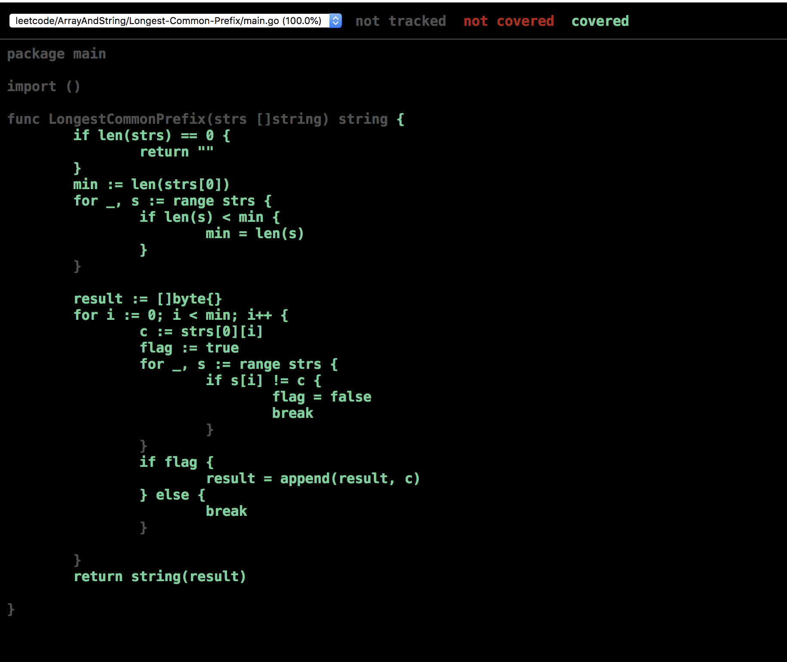

# leetcode

### 简介
存放了在leetcode网站上的算法题的题目和解法。

### 项目目录
- [x] ArrayAndString       数组和字符串相关算法
  - [x] [Diagonal-Traverse](https://github.com/FengGeSe/leetcode/blob/master/ArrayAndString/Add-Binary/README.md)
  - [x] [Find-Pivot-Index](https://github.com/FengGeSe/leetcode/blob/master/ArrayAndString/Find-Pivot-Index/README.md)
  - [x] [Largest-Number-Twice-Others](https://github.com/FengGeSe/leetcode/blob/master/ArrayAndString/Largest-Number-Twice-Others/README.md)
  - [x] [Plus-One](https://github.com/FengGeSe/leetcode/blob/master/ArrayAndString/Plus-One/README.md)
  - [x] [Sprial-Matrix](https://github.com/FengGeSe/leetcode/blob/master/ArrayAndString/Sprial-Matrix/README.md)
  - [x] [Pascal-Triangle](https://github.com/FengGeSe/leetcode/blob/master/ArrayAndString/Pascal-Triangle/README.md)
  - [x] [Add-Binary](https://github.com/FengGeSe/leetcode/blob/master/ArrayAndString/Add-Binary/README.md)
  - [x] [Implement-StrStr](https://github.com/FengGeSe/leetcode/blob/master/ArrayAndString/Implement-StrStr/README.md)
  - [x] [Longest-Common-Prefix](https://github.com/FengGeSe/leetcode/blob/master/ArrayAndString/Longest-Common-Prefix/README.md)
  - [x] [Reverse-String](https://github.com/FengGeSe/leetcode/blob/master/ArrayAndString/Reverse-String/README.md)
  - [x] [Array-Parttition](https://github.com/FengGeSe/leetcode/blob/master/ArrayAndString/Array-Parttition/README.md)

- [x] [Sort](https://github.com/FengGeSe/leetcode/blob/master/Sort/README.md)

### 算法目录

```
.
├── README.md
├── c.out
├── main.go
├── my_test.go
└── test.sh
```

* 功能能测试

```bash
$ go test -v .
```

```bash
=== RUN   TestFindPivotIndex

  Input:[] Output:-1 ✔


1 total assertion


  Input:[0, 0] Output:0 ✔


2 total assertions


  Input:[1, 7, 3, 6, 5, 6] Output:3 ✔


3 total assertions


  Input:[1, 2, 2, 1] Output:-1 ✔


4 total assertions

--- PASS: TestFindPivotIndex (0.00s)
PASS
ok  	leetcode/ArrayAndString/Find-Pivot-Index	(cached)
```


* 代码覆盖率测试

```bash
# 打开网页
$ go test -coverprofile=c.out && \
    go tool cover -html=c.out
```




```bash
$  go test -coverprofile=c.out && \
     go tool cover -func=c.out
```

```bash
leetcode/ArrayAndString/Find-Pivot-Index/main.go:5:	FindPivotIndex	100.0%
total:							(statements)	100.0%
```


* 基准测试

```bash
$ go test -bench .
```

```bash
goos: darwin
goarch: amd64
pkg: leetcode/ArrayAndString/Find-Pivot-Index
BenchmarkFindPivotIndex-4   	200000000	         7.79 ns/op
PASS
ok  	leetcode/ArrayAndString/Find-Pivot-Index	2.365s
```


### 模板

* main.go

```go
package main

import ()

func FindPivotIndex(nums []int) int {
	...
}
```


* my_test.go

```go
package main

import (
	. "github.com/smartystreets/goconvey/convey"
	"testing"
)

// 表格驱动测试
func TestFindPivotIndex(t *testing.T) {
	cases := []struct {
		...
	}{
		...
	}

	for _, c := range cases {
		Convey(c.Name, t, func() {
			So(FindPivotIndex(c.Nums), ShouldEqual, c.Pivot)
		})
	}

}

// 基准测试
func BenchmarkFindPivotIndex(b *testing.B) {
	nums := []int{1, 7, 3, 6, 5, 6}
	for i := 0; i < b.N; i++ {
		FindPivotIndex(nums)
	}
}
```


* test.sh

```bash
#!/bin/bash

# 功能测试
go test -v .

# 代码覆盖率测试
go test -coverprofile=c.out && \
    go tool cover -html=c.out


# 性能测试
go test -bench .
```

